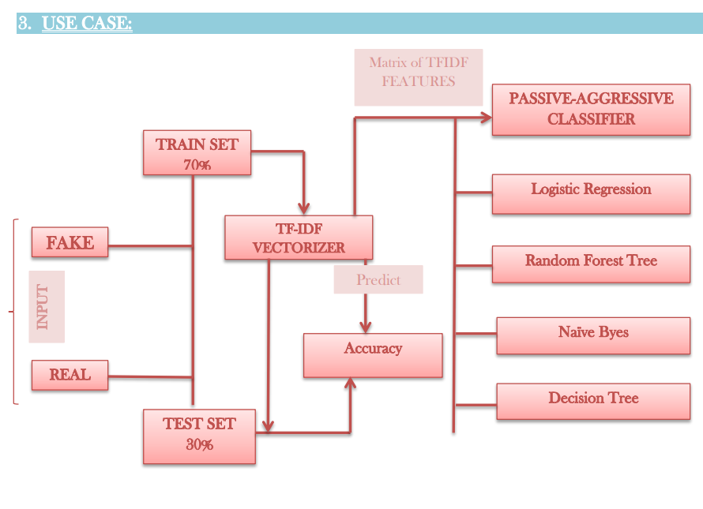
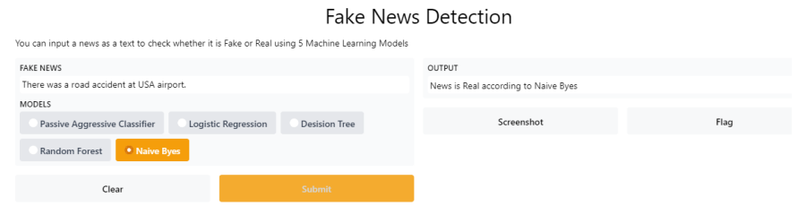

# Fake-News-Detection-using-Machine-Learning

## Project Name: Fake News Detection with Machine Learning and GUI

### Project Description:
The Fake News Detection project aims to develop a machine learning-based solution for identifying and classifying fake news articles. The project leverages word vector representation techniques, TF-IDF vectorization, and various machine learning algorithms to achieve accurate classification. Additionally, the project incorporates a graphical user interface (GUI) using the Gradio library for user interaction.

### User Interface
 
  
  

### Key Features:

#### Word Vector Representation:
The project utilizes word vector representations, such as Bag of Words (BoW), to convert textual data into numerical vectors. This representation enables capturing the semantic meaning of words and sentences, facilitating effective analysis.

##### TF-IDF Vectorizer:
The project employs the TF-IDF technique for feature extraction. TF-IDF computes the importance of words in a document by considering both their frequency in the document and their rarity across the entire corpus. This approach helps identify significant words and improves the accuracy of the classification.

#### Sampling Techniques:
The project adopts stratified proportional allocation and random shuffling to split the data into training, validation, and test sets. This ensures representative datasets for training and evaluating the machine learning models.

#### Data Preprocessing:
The project includes data preprocessing steps, such as stop word removal. Stop words, which are commonly occurring words with little contextual significance, are filtered out to enhance the efficiency of natural language processing algorithms.

##### Machine Learning Algorithms:
The project evaluates seven different machine learning algorithms, including Passive Aggressive Classifier, Multinomial Naive Bayes, Decision Tree, Logistic Regression, and Random Forest. These algorithms are trained and tested on the prepared datasets to classify news articles as fake or real.

#### GUI-based Interaction:
The project integrates a graphical user interface (GUI) using the Gradio library. The GUI provides an intuitive interface for users to interact with the system. Users can input news articles and obtain predictions regarding their authenticity, facilitating easy usage and interpretation.

## Technologies Used:

Python: The project is implemented in Python, leveraging its extensive libraries and frameworks for machine learning and GUI development.
Machine Learning Libraries: Various machine learning libraries, such as scikit-learn, are utilized to implement the classification algorithms and perform model training and evaluation.
Gradio: The Gradio library is employed to create the graphical user interface, enabling users to interact with the fake news detection system seamlessly.
The Fake News Detection project combines machine learning techniques, including word vector representation and TF-IDF, with a user-friendly GUI. By leveraging these technologies, the project provides an effective solution for identifying and classifying fake news articles, contributing to combating misinformation and promoting information accuracy.

